# Writing Test (3-7 Oktober 2022)

## JAVASCRIPT INTERMEDIATE

### ARRAY

#### Apa itu Array?

- Array adalah tipe data list order yang dapat menyimpan tipe data apapun di dalamnya.
- Array dapat menyimpan tipe data String, Number, Boolean, dan lainnya.

#### Contoh Array

    const cars = [                    
    "Saab",
    "Volvo",             
    "BMW"
    ];

--- 

    const cars = [];
    cars[0]= "Saab";
    cars[1]= "Volvo";
    cars[2]= "BMW";

--- 

    const cars = new Array("Saab", "Volvo", "BMW");

#### Membuat dan Memanggil Array

- Membuat Array
  
  `const array_name = [item1, item2, ...]; `

- Memanggil Array
  
  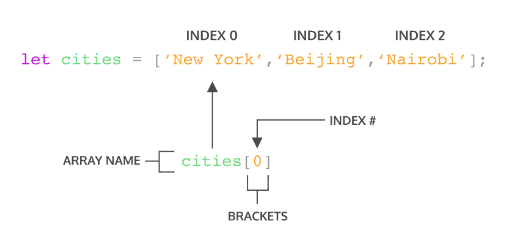

  `console.log(array_name);`
  atau
  `console.log(array_name[index]);`

- Contoh
  
        let arrBuah = [
        "jeruk", 
        "semangka", 
        "pepaya", 
        "rambutan",
        "melon",
        "belimbing"
        ]

        console.log(arrBuah);

  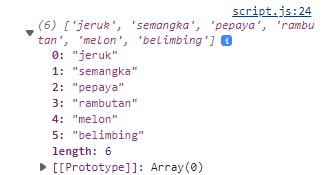

#### Update Array
Seperti tipe data dan variabel pada umumnya, kita dapat mengupdate data pada Array. Contohnya:

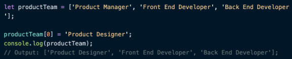

#### Const in Array

- Jika menggunakan let, kita dapat mengubah array  dengan array baru dan konten nilai yang ada di dalam array dengan nilai lain
- Const tidak bisa melakukan update data. Namun pada Array kita dapat melakukan update konten nilai di dalam array (mutable).
- Yang tidak bisa adalah mengubah array dengan array yang baru jika menggunakan const

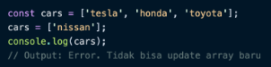
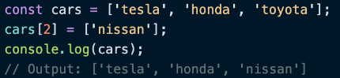

#### Array Properties

- Properties adalah fitur yang sudah disediakan oleh Javascript untuk memudahkan developer.
- Array memiliki 5 properti yang sering digunakan yaitu constructor, length, index, input, dan prototype.
    - Constructor
        Properti constructormengembalikan fungsi yang membuat prototipe Array. Untuk array JavaScript, `constructor` properti mengembalikan:
        `function Array() { [native code] }`
        syntax:
        `array.constructor`
        contoh:

            

            //output : function Array() { [native code] }

    - Length
        Properti length menetapkan atau mengembalikan jumlah elemen dalam array. contoh:

            
             
            //output : 4
        atau

            

            //output : Banana, Orange

    - Prototype
      - `prototype` memungkinkan untuk menambahkan properti dan metode baru ke array. syntax:
        `Array.prototype.name = value`
      - Properti `prototype` JavaScript memungkinkan untuk menambahkan properti baru ke objek. contoh:
  
            
            //output : My father is English
                       My mother is English

#### Array Methods

- Array memiliki method atau biasa disebut built-in methods.
- Artinya Javascript sudah memudahkan kita dengan menyediakan function/method umum yang bisa kita gunakan. 
- Kita tidak perlu membuat function lagi jika method yang kita butuhkan sudah tersedia.
- contoh:
  - `.push()` adalah method untuk menambahkan item  array pada urutan yang paling akhir.
  - `.pop()` adalah method yang menghapus item array index terakhir.
  - `.shift()` adalah method untuk menghapus item Array pada index pertama
  - `.unshift()` adalah method untuk menambahkan item Array pada index pertama
  - `.sort()` adalah method untuk mengurutkan secara Ascending atau Descending Alphanumeric.

#### Looping in Array

- Array memiliki built in methods untuk melakukan looping yaitu .map() dan .forEach()
    - `.forEach()` adalah method untuk melakukan looping pada setiap elemen array. Menggunakan `.forEach()` jika hanya memerlukan looping untuk menampilkan saja atau menyimpan ke database.
    
            // ========= contoh kasus ===========
            // Merubah angka desimal menjadi persen
            let angkaDes = [
            0.45,
            0.67,
            0.23,
            0.76,
            ]

            // Cara forEach
            let angkaPersenForEach = []
            angkaDes.forEach((item) => {
            angkaPersenForEach.push(item * 100 + "%")
            })
            console.log(angkaPersenForEach)

        Output:
        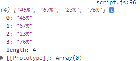

    - `.map()` melakukan perulangan/looping dengan membuat array baru. Menggunakan `.map()` jika akan melakukan operasi pada array seperti yang dapat mengubah nilai array sebelumnya.
            
            // ========= contoh kasus ===========
            // Merubah angka desimal menjadi persen
            let angkaDes = [
            0.45,
            0.67,
            0.23,
            0.76,
            ]

            // Cara map
            // kasus seperti ini lebih dianjurkan menggunakan map
            let angkaPersenMap = angkaDes.map((item) => {
            return item * 100 + "%"
            })
            console.log(angkaPersenMap);

        Output:
        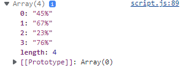

- Bisa lihat bahwa `.map()` dan `forEach()` sama-sama melakukan looping dan mengembalikan nilai baru dari operasi yang dilakukan.
- Perbedaannya adalah `.forEach` tidak dapat membuat Array baru dari hasil operasi yang ada dalam looping.
- Dari segi performance juga sangat jauh.

### MULTIDIMENSIONAL ARRAY
- Multidimensional Array bisa dianalogikan dengan array of array. Ada array didalam array.
  
  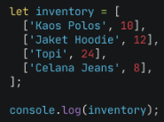

  Output:

  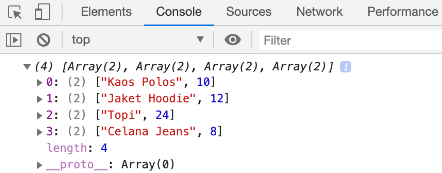

- Cara akses index multidimensional array
  
  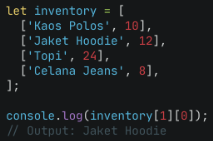

- Sama seperti array satu dimensi, multidimensional array juga dapat menggunakan Property dan Method built-in Array.

  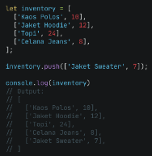

- Operation using map in multidimensional array

  

- Looping For Multidimensional Array
  
  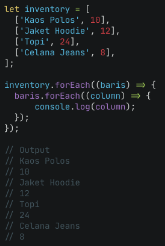

  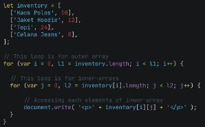
  

### OBJECT

#### Apa itu object?

- Object adalah sebuah tipe data pada variabel yang menyimpan properti dan fungsi (method).
- Properti adalah data lengkap dari sebuah object.
- Method adalah action dari sebuah object. Apa saja yang dapat dilakukan dari suatu object.
- Contoh objek mobil dengan properti nilai dan method

  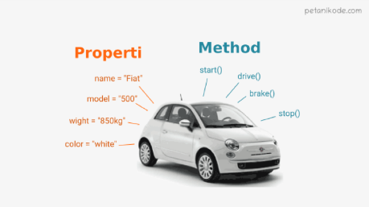

#### Membuat Sebuah Object

- Sama seperti tipe data number, string, boolean, null, undefined, array. Object dapat diassign kedalam sebuah variabel.
  
  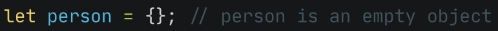

  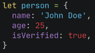

- Sama seperti array, didalam object kita dapat menyimpan properti dengan tipe data apapun.

#### Mengakses Object dan Property Object

- Mengakses seluruh Object
  
  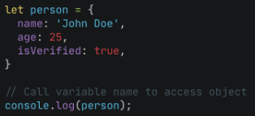

  Output:

  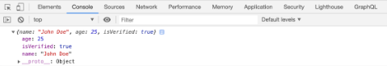

- Menggunakan single quote pada key jika menggunakan spasi seperti `‘current address’`
  
  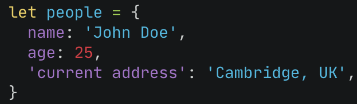

- Mengakses properti object
  
  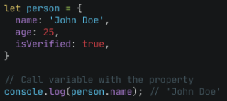

  Output:

  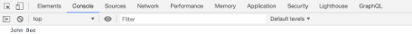

- Bisa menggunakan bracket notation saat memanggil properti dari sebuah object.
  
  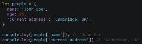

#### Update Object

- Object dapat mengupdate value dari key yang sudah tersedia
- Object dapat menambahkan key dan value baru
  
  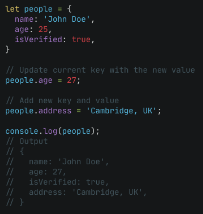

#### Delete Object Property

-  Menghapus properti dari object bisa menggunakan delete operator.
  
   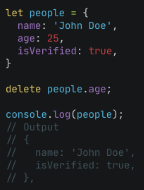

#### Method

- Method adalah value yang kita masukkan pada property berupa function.
- Misal akan membuat method untuk greeting pada aplikasi ecommerce. Terdapat 2 method pada object greeting.
  
  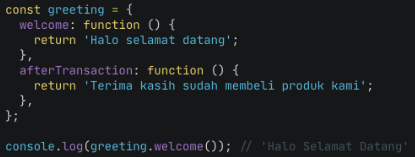

#### Nested Object

- Object yang berasal dari turunan object lainnya.

  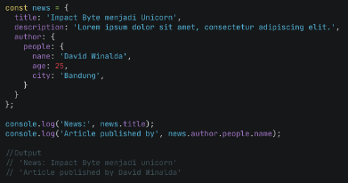

#### Passed By Reference

- mengubah data yang ada pada object melalui sebuah function dan memasukkan object sebagai parameter function.

  Contoh mengubah data object number dengan sebuah function changeData

  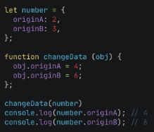

#### Looping Object

- Jika ingin menampilkan seluruh object properti, bisa menggunakan looping.
  
  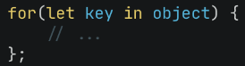

  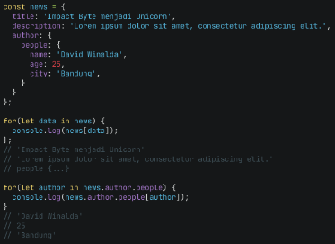

#### Array of Object

- Contoh looping pada Data array of object students
  
  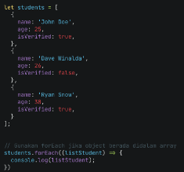

  Output:

  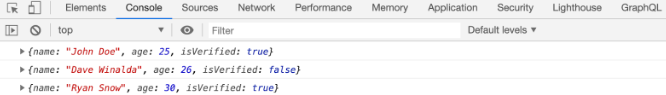

### RECURSIVE

- Recursive adalah function yang memanggil dirinya sendiri sampai kondisi tertentu.
- Recursive kebanyakan digunakan untuk case matematika, fisika, kimia, dan yang berhubungan dengan calculation.
- Struktur Recursive
  
  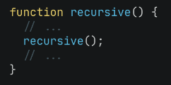

- Recursive akan berhenti memanggil dirinya sendiri jika kondisi terpenuhi.
  
  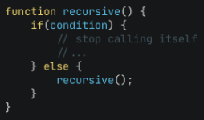

- Ciri Recursive:
  - Fungsi rekursif selalu memiliki kondisi yang menyatakan kapan fungsi tersebut berhenti. Kondisi ini harus dapat dibuktikan akan tercapai, karena jika tidak tercapai maka kita tidak dapat membuktikan bahwa fungsi akan berhenti, yang berarti algoritma kita tidak benar.
  - Fungsi rekursif selalu memanggil dirinya sendiri sambil mengurangi atau memecahkan data masukan setiap panggilannya. Hal ini penting diingat, karena tujuan utama dari rekursif ialah memecahkan masalah dengan mengurangi masalah tersebut menjadi masalah-masalah kecil.

- Contoh Recursive:
  - Fungsi rekursif menghitung mundur number
  
    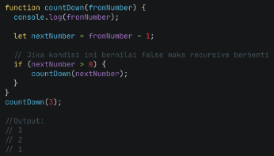

  - Mencari hasil dari nilai pangkat dengan rekursif
  
    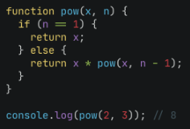

### WEB STORAGE

Cookie VS Local Storage VS Session Storage

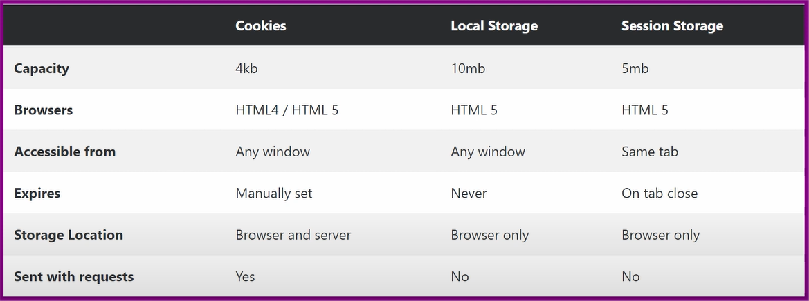

- __Cookie__
  
  cookie ini adalah suatu penyimpanan yang dilakukan javascript kepada browser biasanya untuk menyimpan password dan username. Data yang menggunakan cookie ini lebih dapat tersimpan dengan aman. Memakai cookie kita bisa mengatur waktunya sesuai dengan yang kita inginkan, Waktu bisa di set 1 jam hingga 1 hari bahkan 1 minggu, dan apabila browser ditutup cookie masih bisa digunakan sesuai dengan waktu yang telah ditentukan. tetapi data cookie ini akan bersifat sementara meskipun anda tidak mengatur waktunya maka secara default cookie ini akan menghapus datanya dengan waktu.

  cara untuk membuat perintah penyimpanan:

  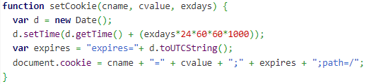 

  cara untuk mengambil perintah penyimpanan:

  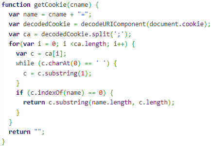 

- __Local Storage__
  
   local storage adalah sebuah penyimpanan data dimana data ini akan terus ada tidak akan pernah bisa terhapus meskipun browser ditutup, komputer dimatikan, data ini bisa hilang apabila anda menjalankan perintah hapus dan browser dilakukan clear data atau cookie juga uninstall. 

   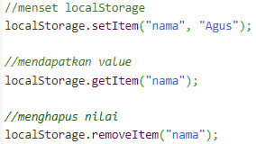 

- __Session Storage__
  
  Session storage ini adalah sebuah penyimpanan data yang hanya bertahan ketika browser tidak ditutup atau tab tidak ditutup, Apabila browser ditutup maka secara otomatis data yang disimpan di session storage akan hilang. Biasanya data yang disimpan disini adalah data yang dimaksudkan agar setelah browser ditutup atau tab didutup data akan hilang. 

  Biasanya adalah data login untuk perbankan, ketika anda login diweb mandiri ataupun BCA ketika anda menutup browser anda maka secara otomatis akan hilang dan anda akan diminta untuk melakukan login kembali.

   

### ASYNCRONOUS

Asynchronous hasil eksekusi atau output tidak selalu berdasarkan urutan kode, tetapi berdasarkan waktu proses. Eksekusi dengan asynchronous tidak akan membloking atau menunggu suatu perintah sampai selesai.

Contoh:

    console.log('Hello');
    setTimeout(() => { console.log('Javascript')},100) // tunda selama 100 miliseconds
    console.log('Coder');

    /* ----------
    Output :
    Hello!
    Coder
    Javascipt
    ------------*/

Pada baris ke 2 setTimeout digunakan untuk menunda eksekusi dalam satuan milisecond, dalam hal ini untuk simulasi proses async.

Perhatikan bahwa outputnya tidak berurutan sesuai input (kode). Karena cara kerja asynchronous adalah berdasarkan waktu proses. Jika ada salah satu eksekusi membutuhkan proses yang agak lama, maka sembari menunggu proses tersebut javascript mengeksekusi perintah selanjutnya.

#### Promises

Dalam dunia promise analogi di atas juga sama, ketika melakukan request asynchronous seperti Ajax, maka ada 3 kemungkinan state :

- Pending ( sedang dalam proses )
- Fulfilled ( berhasil )
- Rejected ( gagal )

Benefit utama dari promise adalah membuat code lebih readable dan manajemen error yang lebih baik.

- Membuat Promises
  
  Untuk membuat promise cukup dengan memanggil constructor nya :

  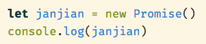

- Untuk mengatur state Fullfilled dan Reject menggunakan salah satu listener, resolve() atau reject()

  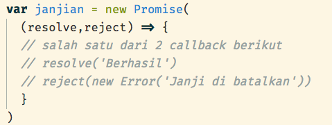

  Untuk menggunakan promise diatas gunakan method then dan catch

  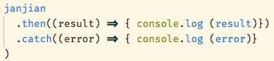

  Output dari code diatas ada 2 kemungkinan,
  - Jika comment pada resolve( ) di hapus maka hasilnya “berhasil”
  - Jika comment pada reject( ) di hapus maka hasilnya “Janji di batalkan”

  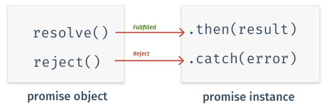
