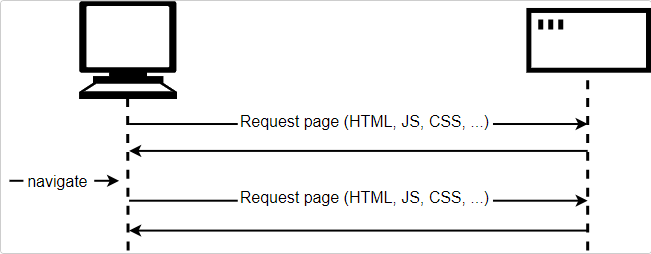
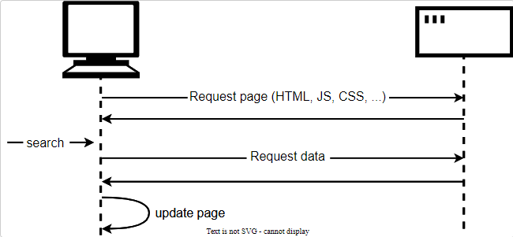
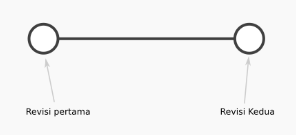

# Writing Test (10-12 Oktober 2022)

## JAVASCRIPT INTERMEDIATE

### Asynchronous - Fetch 
Tugas yang sangat umum di situs web dan aplikasi modern adalah mengambil item data individual dari server untuk memperbarui bagian halaman web tanpa harus memuat seluruh halaman baru. Antarmuka Fetch API memungkinkan browser web membuat permintaan HTTP ke server web.

- __Pengantar__
    Halaman web terdiri dari halaman HTML dan (biasanya) berbagai file lain, seperti stylesheet, skrip, dan gambar. Model dasar pemuatan halaman di Web adalah browser Anda membuat satu atau lebih permintaan HTTP ke server untuk file yang diperlukan untuk menampilkan halaman, dan server merespons dengan file yang diminta. Jika Anda mengunjungi halaman lain, browser meminta file baru, dan server meresponsnya.

    

    Model ini bekerja dengan sangat baik untuk banyak situs. Tetapi pertimbangkan situs web yang sangat didorong oleh data. Misalnya, situs web perpustakaan seperti Perpustakaan Umum Vancouver. Antara lain Anda bisa menganggap situs seperti ini sebagai antarmuka pengguna ke database. Ini mungkin memungkinkan Anda mencari genre buku tertentu, atau mungkin menunjukkan rekomendasi untuk buku yang mungkin Anda sukai, berdasarkan buku yang Anda pinjam sebelumnya. Saat Anda melakukan ini, halaman perlu diperbarui dengan kumpulan buku baru untuk ditampilkan. Namun perhatikan bahwa sebagian besar konten halaman termasuk item seperti header halaman, sidebar, dan footer tetap sama.

    Masalah dengan model tradisional di sini adalah kita harus mengambil dan memuat seluruh halaman, bahkan ketika kita hanya perlu memperbarui satu bagian saja. Ini tidak efisien dan dapat mengakibatkan pengalaman pengguna yang buruk.

    Jadi, alih-alih model tradisional, banyak situs web menggunakan API JavaScript untuk meminta data dari server dan memperbarui konten halaman tanpa memuat halaman. Jadi ketika pengguna mencari produk baru, browser hanya meminta data yang diperlukan untuk memperbarui halaman misalnya kumpulan buku baru untuk ditampilkan.

    

    API utama di sini adalah Fetch API. Ini memungkinkan JavaScript yang berjalan di halaman untuk membuat permintaan HTTP ke server untuk mengambil sumber daya tertentu. Saat server menyediakannya, JavaScript dapat menggunakan data untuk memperbarui halaman, biasanya dengan menggunakan API manipulasi DOM. Data yang diminta seringkali berupa JSON, yang merupakan format yang baik untuk mentransfer data terstruktur, tetapi bisa juga berupa HTML atau hanya teks.

    Ini adalah pola umum untuk situs berbasis data seperti Amazon, YouTube, eBay, dan sebagainya. Dengan model ini:

    - Pembaruan halaman jauh lebih cepat dan Anda tidak perlu menunggu halaman disegarkan, artinya situs terasa lebih cepat dan lebih responsif.
    - Lebih sedikit data yang diunduh pada setiap pembaruan, yang berarti lebih sedikit bandwidth yang terbuang. Ini mungkin bukan masalah besar pada desktop pada koneksi broadband, tetapi ini adalah masalah besar pada perangkat seluler dan di negara-negara yang tidak memiliki layanan internet cepat di mana-mana.
  
    Untuk mempercepat, beberapa situs juga menyimpan aset dan data di komputer pengguna saat pertama kali diminta, yang berarti bahwa pada kunjungan berikutnya mereka menggunakan versi lokal alih-alih mengunduh salinan baru setiap kali halaman pertama kali dimuat. Konten hanya dimuat ulang dari server ketika telah diperbarui.

- __Contoh__

        const verseChoose = document.querySelector('select');
        const poemDisplay = document.querySelector('pre');

        verseChoose.addEventListener('change', () => {
        const verse = verseChoose.value;
        updateDisplay(verse);
        });

### Asynchronous - Async Await

Async/await adalah fitur yang hadir sejak ES2017. Fitur ini mempermudah kita dalam menangani proses asynchronous. Async/Await merupakan sebuah syntax khusus yang digunakan untuk menangani Promise agar penulisan code lebih efisien dan rapih.
Async/Await terbagi menjadi Async dan Await,contoh:

    const getAllUser = async ()=> {
        const data = await getUser()
        console.log(data)
    }

- Async/Await adalah salah satu cara untuk mengatasai masalah asynchronous pada Javascript selain menggunakan callback dan promise.
- Pada implementasi Async/Await, kita menggunakan kata kunci async sebelum fungsi. Await sendiri hanya bisa digunakan pada fungsi yang menggunakan async.
- Untuk menggunakan Async/Await, kembalian dari suatu fungsi harus merupakan suatu Promise. Async/Await tidak dapat berdiri tanpa adanya Promise.
- Tidak seperti Promise, dengan Async/Await maka suatu baris kode dapat tersusun rapi mirip dengan kode yang sifatnya synchronous.
- Setiap baris yang menggunakan await, akan ditunggu sampai Asynchronous Promise tersebut di resolve.

sumber : https://www.matawebsite.com/blog/mengenal-async-await-javascript#:~:text=Async%2Fawait%20adalah%20fitur%20yang,code%20lebih%20efisien%20dan%20rapih.

### Git & Github Lanjutan

- __GIT ADD__
    Setelah cek status dengan `git status`, selanjutnya kita ubah status untrackted file dan unmodified menjadi modified dengan menggunakan:

    `git add .`

- __GIT COMMIT__
    Lakukan `git commit` untuk save perubahan pada version control.

    `git commit -m "first commit"`

- __GIT LOG__
    

    Kedua revisi diatas kita anggap sebagai checkpoint. Jika nanti ada kesalahan, kita bisa kembali pada checkpoint ini. 

    Dari dua revisi yang sudah dilakukan kita dapat melihat catatal log dari revisi - revisi tersebut dengan menggunakan perintah berikut ini:

    `git log`

- __GIT CHECKOUT, GIT RESET, GIT REVERT__
    Jika perubahan yang sedang dilakukan terjadi kesalahan dan kita ingin mengembalikan keadaan seperti sebelumnya maka itu bisa dilakukan.

    - Untuk Membatalkan Perubahan Belum Stagged dan Belum Commited, maka bisa dilakukan dengan perintah `git checkout` berikut ini: 
        `git checkout index.html`
    - Untuk Membatalkan Perubahan Sudah Stagged namun Belum Commited, maka bisa dilakukan dengan perintah `git reset` berikut ini:
        `git reset index.html`
    - Untuk membatalkan semua perubahan yang ada tanpa menghapus commit terakhir. maka bisa dilakukan dengan perintah `git revert` berikut ini:
        `git revert -n <nomor commit>`
    Jika menggunakan GIT Reset, commit terakhir akan hilang.

- __GIT BRANCH__
  - Merupakan fitur yang WAJIB digunakan jika berkolaborasi dengan developer atau dalam tim.
  - Untuk menghindari conflict code yang dikembangkan. Kita tidak boleh berkolaborasi dalam project di satu branch yang sama! Misalnya Bowo akan mengerjakan fitur A dan Gigih mengerjakan fitur B. Masing-masing fitur harus dibuat branch masing-masing.
  - Untuk membuat branch, gunakan perintah berikut ini:
    `git branch <branch>`

    Misalkan kita ingin membuat fitur register. Jadi kita akan membuat branch baru.
    `git branch fitur_register`
  - Untuk melihat list branch, maka kita bisa menggunakan:
    `git branch`
  - Untuk menuju kedalam suatu branch tertentu. dapat menggunakan perintah seperti berikut ini:
    `git checkout fitur_register`
  - Untuk menghapus sebuah branch, dapat menggunakan perintah seperti berikut ini:
    `git branch -d <branch>`

- __GIT MERGE__
  Untuk menyatukan branch cabang fitur yang telah kita kembangkan. Gunakan perintah seperti berikut ini:
  1.  Checkout dahulu ke branch master
        `git checkout master`
  2.  Melakukan merge
        `git merge halaman-login`

### Responsive Web Design

Responsive web design adalah bertujuan untuk membuat design website kita dapat diakses dalam device apapun.

Setiap developer website wajib menggunakan tools bawaan dari setiap browser yang dapat memudahkan development website. Pada browser chrome biasa disebut dengan chrome dev tools.

cara menggunakan chrome dev toools dari RWD.
1. Membuka browser chrome dan menggunakan shortcut ini: `ctrl+shift+j` 
2. Klik icon yang mengilustrasikan phone dan tablet
3. Add viewport in HTML
4. Menggunakan elemen max-width agar panjang image menjadi overflow karena mengikuti width real bawaan dari file image. 
5. Menggunakan media query. Jenis media query ada 2 yakni, max-width dan min width.
6. Menggunakan Breakpoint yang merupakan perubahan yang terjadi pada tampilan saat berganti device atau ukuran width.

### Bootstrap 5

Bootstrap adalah framework HTML, CSS, dan JavaScript yang berfungsi untuk mendesain website responsive dengan cepat dan mudah. 

Framework open source ini diciptakan pada tahun 2011 oleh Mark Otto dan Jacob Thornton dari Twitter. Itulah kenapa dulunya Bootstrap dinamakan Twitter Blueprint. 

Kegunaan bootsrap :

- Menciptakan website Mobile Friendly, Berkat sistem grid, proses membuat website mobile friendly tak akan membutuhkan waktu lama.
- Memudahkan resize gambar, cukup dengan menambahkan class.img-responsive ke gambar, maka gambar tersebut akan otomatis di-resize sesuai ukuran layar pengguna.
- Menambahkan elemen website tanpa ribet, Bootstrap menyediakan berbagai elemen yang bisa langsung Anda gunakan di website. Misalnya, navigasi, menu dropdown, thumbnail, dan sebagainya.
- Membuat website lebih interaktif, Bootstrap juga memungkinkan Anda menggunakan plugin custom JQuery. Jadi, Anda bisa menambahkan berbagai elemen interaktif ke website dengan mudah. Misalnya, popup, transisi, image carousel, dan sebagainya.

sumber : https://www.niagahoster.co.id/blog/bootstrap-adalah/
