# WRITING TEST (31 OKTOBER - 4 NOVEMBER 2022)

## Database MySQL Basic 

- Database merupakan tempat penyimpanan data yang terstruktur.
- Untuk mengakses database, dapat menggunakan DBMS
- Didalam DBMS, dapat digunakan untuk membuat beberapa/banyak database.
- Macam-macam DBMS yang bertipe SQL yaitu MySQL, MariaDB, PosgreSQL, Oracle, IBM DB2
- MySQL bersifat opensource dan compatible untuk banyak platform
- Tampilan dari MySQL Workbench
  
- Saat membuat database harus ada server yang berjalan yaitu MySQL Server dengan nomor port pada umumnya yaitu 3306, untuk mengakses MySQL Server dapat menggunakan MySQL Workbench / Dbeaver / TablePlus / Php My Admin.
- Cara connect SQL, dapat melakukan klik tanda + pada MySQL Connection di workbench. Kemudian, mengisi nama koneksi, hostname, port, username, dan password. Maka akan tampil tampilan berikut pada saat setelah klik test connection.
  
- Berikut ini, tampilan workbench setelah melakukan test connection
  
  Pada tampilan diatas, terlihat terdapat nama koneksi yaitu localhost.
- Setelah itu, melakukan klik 2 kali pada nama koneksi localhost. Dan berikut ini adalah tampilannya.
  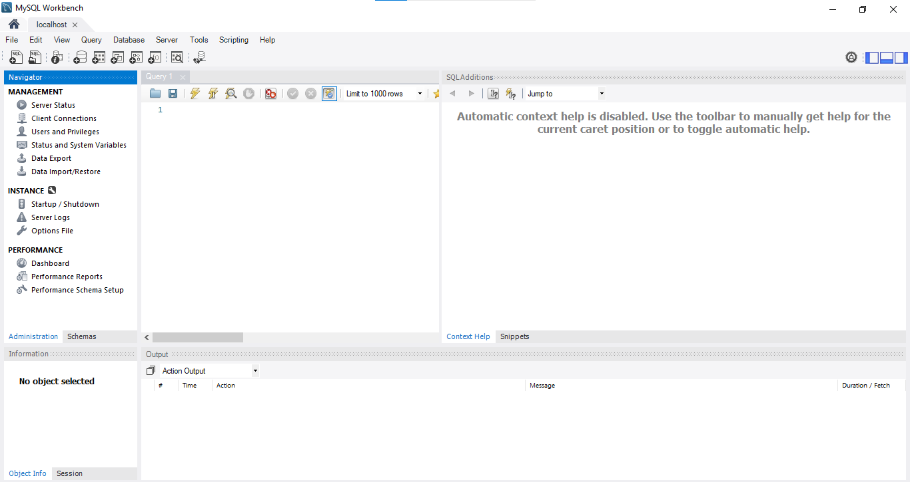
- Didalam SQL terdapat beberapa macam tipe data yaitu:
  - Number : int, float, decimal
  - Boolean : Char, VarChar, Text, Enum
  - String : True or False
  - Tanggal : DATE, DATETIME, TIME, timestamp
  - Default : NULL
- Istilah dalam database
  - Table : kumpulan value yang dibangun oleh baris dan kolom, yang didalamnya berisikan atribut dari sebuah data.
  - Field/atribut : kolom dari sebuah tabel dimana masing-masing field memiliki tipe data masing-masing.
  - Record : kumpulan nilai yang saling terkait. Record merupakan isi dari sebuah tabel.
- Terdapat 4 Perintah Dasar di SQL:
  
  - DDL, bermain di table
  - DML, bermain di data
- Cara membuat dan menggunakan database 
  
- Cara Membuat Table
  
- Untuk melihat apa saja table yang terdapat pada database
  
- Untuk melihat kolom yang ada pada table
  
- Untuk menghapus table
  
- Menambahkan atribut pada table
  
  Alter dapat menambah kolom atau menghapus kolom pada table.
- Untuk menambahkan data dalam table dan melihat isi table
  
- Untuk memperbarui data dalam table
  
- Untuk menghapus data 
  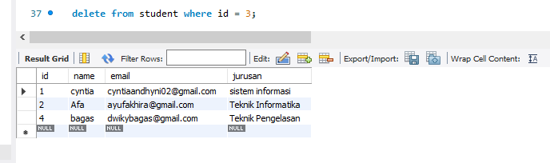
- Untuk mengubah nama kolom hanya sementara pada saat ingin dilihat
  
- Untuk mencari data yang memiliki email gmail
  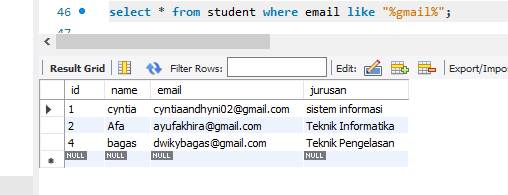
- Untuk memanggil data dengan jumlah tertentu
  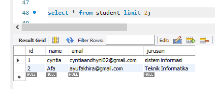
- Untuk memanggil data dari id terbesar
  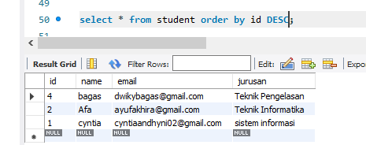

## MySQL Lanjutan
- Tipe-tipe Relasi
  1. One to one : 1 entitas, cuma boleh memiliki 1 entitas yang lain. Contoh : 1 buku memiliki 1 ISBN atau 1 ISBN dimiliki oleh 1 buku.
  2. One to many : 1 entitas punya banyak relasi. Contoh : 1 penerbit bisa menerbitkan banyak buku.
  3. Many to many : akan muncul conjunction tambahan ditengah-tengahnya.
- Normalisasi 
  Digunakan apabila terjadi anomali pada data. contohnya adalah Pada saat kita telah menghapus suatu data, maka data akan menjadi aneh. Atau pada saat data diupdate, data menjadi tidak sesuai.
- Key
  1. Primary Key : identitas dari sebuah row / record yang bersifat unik dan not null.
  2. Unique : data  yang bersifat unik (data dapat bersifat null atau kosong).
  3. Foreign Key : Primary key yang ikut pada tabel lain.
- JOIN 
  Seperti Himpunan, yang digunakan untuk menampilkan data dari foreign key. Terdiri dari:
  1. Right Join : menampilkan semua data yang ada disebelah kanan (meskipun tidak ada relasi).
  2. Inner Join : menampilkan data produk yang memiliki irisan dengan category (mempunyai relasi).
  3. Left Join : mengambil mayoritas data dari tabel produk bagian kiri.
- Demo MySQL
  1. Membuat database store, dapat menggunakan query create database.
  2. Menggunakan database store, dapat menggunakan query use.
  3. Membuat table category dan product dengan menggunakan query create table.
     
  4. Mengisi data category dan product dengan menggunakan query insert into.
  5. Isi data tabel category
     
  6. Isi data tabel product
     
  7. Menampilkan tabel produk, namun atribut category_id diubah menjadi name category.
     
  8. Menampilkan semua data meskipun ada yang tidak berelasi
     
- Aggregate Function
  - Count() : untuk menghitung berapa banyak data yang dicari
    contoh :
    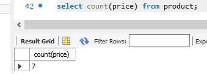
  - Sum() : untuk menjumlahkan atau mengakumulasikan data
    contoh :
    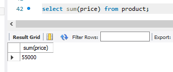
  - Average() : untuk menghitung rata-rata
    contoh :
    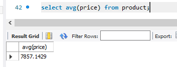
  - Min() : untuk mencari nilai minimum atau terendah
    contoh :
    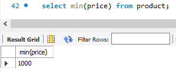
  - Max() : untuk mencari nilai maximum atau tertinggi
    contoh :
    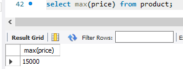
- Menampilkan jumlah setiap category 
  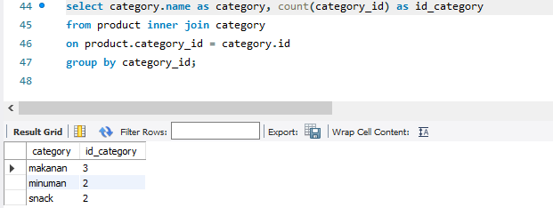
-Perbedaan Having vs Where
  - Where : tertuju pada nama kolom dalam menentukan pencarian
  - Having : nama kolom yang sudah diubah menjadi alias dapat menggunakan having untuk menentukan pencarian data 
     
 

## Authentication & Authorization in Express
## Sequalize
