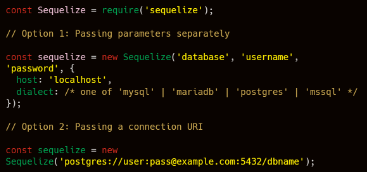

# WRITING TEST (7-11 NOVEMBER 2022)

## Sequelize

Installation Sequelize
- Install Sequelize-cli : menginstall sequelize cli agar dapat menjalankan generator menggunakan terminal sehingga lebih mudah.

        npm install -g sequelize-cli

- Install Sequelize
  
        Installing by NPM
        npm install --save sequelize
        install driver database
        npm install --save mysql

- Generate Sequelize
  - Sequelize init 
    Melakukan inisialisasi di project kita terlebih dahulu agar dapat melakukan generate code.

        npx sequelize-cli init
    
  - Setting Database

    

  - Generate Model
    Membuat table todo dengan field

    

        npx sequelize model:create --name User --attributes name:string,email:string,password:string

        kemudian

        npx sequelize db:migrate

  - Generate Seed
    Seed adalah data awal yang bisa kita gunakan untuk mengisi data di database untuk keperluan awal project menggunakan sequelize.

        npx sequelize seed:create --name demo-user

## MongoDB

- MongoDB adalah salah satu database open source NoSQL yang cukup populer digunakan. NoSQL (Not Only SQL)Artinya kita bisa mengolah database dengan fleksibel dan tidak membutuhkan Query.
- MongoDB sering dipakai untuk aplikasi berbasis Cloud, Big Data maupun Grid COmputing.
- MongoDB menggunakan dokumen dengan format JSON.
- Kelebihan:
  - Sistem tidak membutuhkan Tabel
  - Tidak perlu menggunakan Tabel yang terstruktur
  - By Default sudah menggunakan JSON(JavaScript Object Notation), sehingga memudahkan integrasi dengan JavaScript
  - Performa lebih cepat dengan kemampuan menampung banyak data yang bervariasi
- Kekurangan
  - Tidak mendukung transaksi
  - Masalah konsistensi data
  - Menggunakan banyak memory
  - Hanya bisa menampung maksimal 16MB disetiap document
- MongoDB
  - Tidak ada Formal Process
  - Tidak ada algorithms
  - Tidak ada aturan
  - Dalam mendesain MongoDB kita ada 2 pendekatan yaitu Embedding dan Referencing
  - Embedding
    - Keuntungan
      - Bisa mendapatkan semua data dalam 1 query
      - Bisa mengupdate semua informasi terkait dalam 1 atomic operation
      - Bisa menggunakan trasaksi operator
    - Kekurangan
      - kita tidak memiliki cara untuk dapat mengaksess embended data sebagai entity yang terpisah secara langsung.
      - Memiliki batasan 16 MB document size

  - Referencing
    - Keuntungan
      - Bisa mendapatkan semua data dalam 1 query
      - Bisa mengupdate semua informasi terkait dalam 1 atomic operation
      - Bisa menggunakan trasaksi operator

    - Kekurangan
      - kita tidak memiliki cara untuk dapat mengaksess embended data sebagai entity yang terpisah secara langsung.
      - Memiliki batasan 16 MB document size

- Relasi dalam MongoDB
  - One to one relationship : Cara yang disarankan adalah Embedded
  - One to many relationship : Cara yang disarankan adalah Reference
  - Many to many relationship : Cara yang disarankan adalah Reference

## Mongoose

- Mongoose adalah library yang bisa dibilang sebagai Object Modelling MongoDB untuk NodeJS.
- Mongoose bisa digunakan untuk mengelola hubungan antara data, menyediakan validasi.
- Mongoose juga bisa digunakan untuk menerjemahkan antara objek dalam kode dan representasi Objek tersebut di MongoDB.
- install mongoose : npm install mongoose --save

## Docker

- Latar Belakang
  Terdapat project yang dikerjakan pada komputer A yang memakai OS Linux, kemudian project dikirim pada komputer B yang memakai OS Windows. Pada saat project dijalankan di komputer B, terdapat masalah yang menyebabkan project tidak dapat dijalankan. Maka dari itu, digunakanlah docker untuk mengatasi permasalahan tersebut.

- Docker 
  - Mengkontainerkan aplikasi agar dapat dijalankan pada OS manapun.
  - Setiap container hanya dapat menyimpan 1 aplikasi saja.
   
- Docker Fundamental
  - Docker File
    Blueprint untuk membuat image. Pada docker file berisi step-step yang akan dijalankan.
  - Docker Image
    Template untuk menjalankan container. ketika project dirunning, akan dibungkus oleh container.
  - Container
    Perwujudan dari image
  - Docker Registry 
    Tempat untuk upload/download image. Tempat menyimpan docker image disebuah platform.

- Perintah Dasar
  - Pull : untuk mendownload image dari docker hub
  - docker images : untuk melihat kumpulan images yang sudah terdownload
  - docker run : untuk menjalankan container
  - docker ps : untuk menampilkan container yang sedang berjalan
  - docker ps -a : menampilkan semua container.
  - docker compose : Cara untuk menjalankan lebih dari 1 container secara bersamaan dan saling terhubung. 

