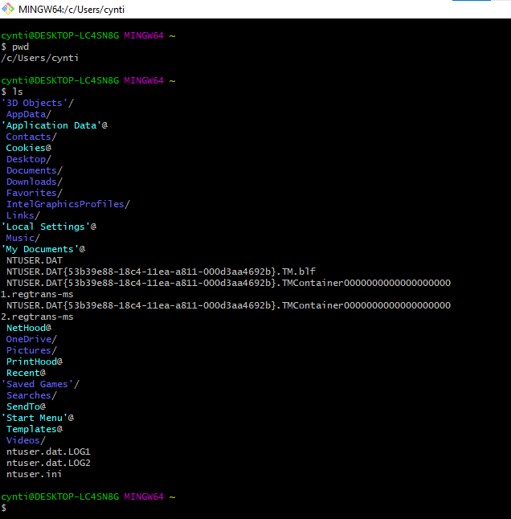
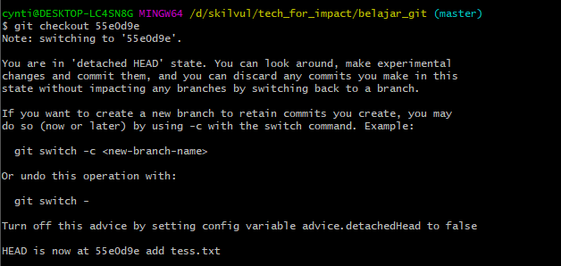
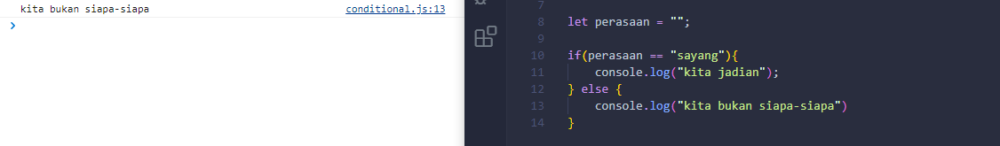
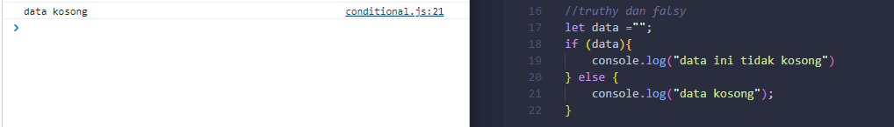

# Writing and Presentation Test (19 - 30 September 2022)

---
## Unix Command Line
---

### Shell

_Shell_ merupakan program yang menerima perintah, kemudian meneruskan perintah tersebut ke system untuk dieksekusi. Atau merupakan penghubung antara file explorer (aplikasi) dengan sistem operasi. Nah, Shell ini terdiri dari 2 tampilan yaitu:
* __GUI__ (Graphical User Interface)
  
  

* __CLI__ (Command Line Interface)
  
  

### Command Line Interface

_Command Line Interface_ merupakan jenis shell yang berbentuk teks. contoh dari CLI yaitu:
* cmd.exe milik Windows
* bash dan zsh di sistem operasi mirip Unix.
  

### Cara Mengakses CLI dan Menggunakan Terminal

Terminal Emulator digunakan untuk mengakses CLI. Nah, kali ini kita akan menggunakan bash untuk mengakses CLI.

### File System Structure

Sebuah filesystem mengatur bagaimana data disimpan di dalam sebuah system. Dalam sistem operasi Windows & Unix-like menyusun file dan direktori menggunakan struktur yang bentuknya mirip tree. 
Berikut ini perbedaan penyusunan direktori windows vs unix-like:

### Command Untuk Navigasi

* __pwd__
  
  _Print working directory_ adalah command untuk melihat current working directory.
  
  

* __ls__
  
  _lists_ adalah command untuk melihat isi file yang ada di sebuah direktori.
  
  

* __cd__
  
  _change directory_ adalah command untuk berpindah direktori.
  
  

### Membuat Files dan Direktori

* __touch__
  
  _touch_ adalah command untuk membuat sebuah file.

  

* __mkdir__
  
  _mkdir_ adalah command untuk membuat sebuah direktori.

  

* __nano__
  
  _nano_ adalah command untuk mengisi file.

  

### Melihat Isi Files

* __head__
  
  _head_ adalah command untuk melihat beberapa line awal dari sebuah file text.

  

* __tail__
  
  _tail_ adalah command untuk melihat beberapa line akhir dari sebuah file text.
  
  

* __cat__
  
  _cat_ adalah command untuk melihat isi sebuah file.

  

### Menyalin, Memindahkan, dan Menghapus Files dan Directory

* __cp__
  
  _cp_ adalah command untuk mengcopy files atau directory.

  

* __mv__
  
  _move_ adalah command untuk memindahkan files atau directory. Bisa juga digunakan untuk merename files atau directory.

  

* __rm__
  
  _remove_ adalah command untuk menghapus file atau directory.

  

  Untuk menghapus folder yang didalamnya ada beberapa file, bisa menggunakan command dibawah ini:

  

---
## Git dan GitHub Dasar
---

### Kenapa Git dan Github tools yang wajib digunakan ya?

Dengan menggunakan GIT dan Github, kita akan bisa bekerja dalam sebuat tim. Tujuan besarnya adalah kita bisa berkolaborasi mengerjakan proyek yang sama tanpa harus repot copy paste folder aplikasi yang terupdate. Kita juga tidak perlu menunggu rekan dalam satu tim kamu menyelesaikan suatu program dahulu untuk berkolaborasi. Kamu bisa membuat file didalam projek yang sama atau membuat code di file yang sama dan menyatukannya saat sudah selesai.

### Perbedaan antara Git dan Github

* Git sebagai version control system memiliki tugas mencatat setiap perubahan pada File (termasuk code yang kita buat) pada suatu proyek baik dikerjakan secara individu maupun tim.
* Git adalah aplikasi yang dapat melacak setiap perubahan yang terjadi pada suatu folder atau file.
* Git biasanya digunakan oleh para programmer sebagai tempat penyimpanan file pemrograman mereka, karena lebih efektif. 
* File -file yg disimpan menggunakan git akan terlacak seluruh perubahannya, termasuk siapa yang mengubah.
* Git adalah softwarenya, sedangkan GitHub adalah tempat untuk mengupload codingannya.

### Kondisi File pada Git

* __Modified__ : kondisi dimana revisi atau perubahan sudah dilakukan, tetapi belum ditandai (untracked) dan belum disimpan dalam version control.
* __Staged__ : kondisi dimana revisi sudah ditandai (modified) namun belum disimpan di version control.
* __Committed__ : kondisi dimana revisi sudah disimpan pada version control.
 
### Repository Git

### Commit pada Git

### Git Log 

### Git Checkout 

### Mempublish aplikasi ke Github

###   Cloning Github ke local

---
## HTML
---

### HTML pada Web Development 

* HTML adalah singkatan dari Hypertext Markup Language.
* HTML digunakan untuk menampilkan konten pada browser. 
* Contoh konten yang dapat ditampilkan seperti Text, Image, Video, Link, dan masih banyak lainnya.
* HTML bersifat statis. HTML hanya bertugas menampilkan konten yang diminta oleh developer.
* HTML bukanlah sebuah bahasa pemrograman, artinya HTML tidak bisa dinamis mengolah data.

### Tools Pendukung dalam Menggunakan HTML 
Ada 2 tools utama yang harus dipersiapkan untuk membuat HTML, yaitu:

1. Browser
1. Code Editor

### HTML sederhana 

    <!DOCTYPE html>
    <html lang="en">
    <head>
        <meta charset="UTF-8">
        <meta http-equiv="X-UA-Compatible" content="IE=edge">
        <meta name="viewport" content="width=device-width, initial-scale=1.0">
        <title>Belajar HTML</title>
    </head>

    <body>
      <section id="profile">
        <h1>Hi... I'm Cyntia</h1>

        <!--lokal-->
        

        <!--internet-->
        

        <ol type="a">
            <li><a href="https://www.linkedin.com/in/cyntia-prisya-andhyni-0509a9205/" >LinkedIn</a></li>
            <li><a href="https://github.com/CyntiaPrisyaAndhyni">GitHub</a></li>
            <li><a href="https://www.instagram.com/cyntiaaaa_/">Instagram</a></li>
        </ol>

      </section> 

      <section id="contact-me">
        <h2>contact me</h2>
        <form action="">
            

                <label for="">name</label>
                <input type="text" name="name" id="name" placeholder="your name"/> 
            

             
            

                <label for="">email</label>
                <input type="email" name="email" id="email" placeholder="your email" />
            

             
            <button>send</button>
        </form>

      </section>
    </body>
    </html>

Berikut ini tampilan file HTML menggunakan Live Server:

Setelah membuat file index.html tersebut, saya akan mengupload file html tersebut ke GitHub dengan menggunakan terminal bash yang terhubung di visual studio code.

Kemudian, Saya akan mendeploy file HTML tersebut ke Netlify. Nah, Deploy adalah sebuah proses untuk menyebarkan aplikasi yang sudah kita kerjakan supaya bisa digunakan oleh orang-orang.

Berikut ini Tampilan dari website cyntia-belajarweb.netlify.app yang sudah di deploy:

---
## CSS
---

### Peran CSS pada Web Development

* CSS adalah bahasa yang digunakan untuk mendesain halaman website.
* Dengan CSS, kita bisa mengubah warna, menggunakan font custom, editing text format, mengatur tata letak, dan lainnya.
  

### 3 Cara Menyisipkan CSS ke dalam HTML

* __Inline CSS__ yaitu menggunakan attribute `style` untuk menyisipkan kode CSS langsung di dalam HTML element.
  
* __Internal CSS__ yaitu menggunakan element `<style>` untuk menyisipkan kode CSS. Element `<style>` tersebut diletakkan di dalam element.
  
* __External CSS__ yaitu sebuah file CSS terpisah yang disambungkan dengan file HTML dengan menggunakan element `<link>`.
  
  

### Flexbox

* Flexbox adalah cara untuk mengatur layout.
* Flexbox direkomendasikan karena penggunaannya yang mudah dan didukung oleh kebanyakan browser.
* Flexbox memiliki kemampuan untuk menyesuaikan layout secara otomatis.
* Flexbox memiliki 1 parent/container dan bisa beberapa child/item.

### Styling CSS 

Website yang belum menggunakan css akan terlihat sangat tidak menarik

    <!DOCTYPE html>
    <html lang="en">
    <head>
        <meta charset="UTF-8">
        <meta http-equiv="X-UA-Compatible" content="IE=edge">
        <meta name="viewport" content="width=device-width, initial-scale=1.0">
        <title>Document</title>
        <link rel="stylesheet" href="style.css">
    </head>

    <body>

        <nav>
            <a href="" class="logo">Cyn</a>
        
            <ul class="nav-menu">
              <li><a href="">Home</a></li>
              <li><a href="">About</a></li>
              <li><a href="">Contact</a></li>
            </ul>
          </nav>
        
          <section class="home">
            <!-- text -->
            

              <h1>hai.. I'm Cyntia Prisya Andhyni</h1>
              <h1>I'm a System Information Student of UPN "Veteran" Jawa Timur</h1>
               
              <a>Hire Me</a>
            

        
            <!-- img -->
            

              
            

          </section>
    </body>
    </html>

Berbeda dengan website yang sudah ditambahkan dengan style CSS

    @import url('https://fonts.googleapis.com/css2?family=Poppins:ital,wght@0,100;0,200;0,300;0,400;0,500;0,600;0,700;0,800;0,900;1,100;1,200;1,300;1,400;1,500;1,600;1,700;1,800&display=swap');

    /* RESET STYLE */
    * {
      margin: 0;
      padding: 0;
      text-decoration: none;
      list-style: none;
      font-family: 'Poppins', sans-serif;
      color: rgb(175, 47, 96);
    }

    /* NAVBAR */
    nav {
      display: flex;
      justify-content: space-between;
      align-items: center;
      padding: 10px 50px;
    }

    .logo {
      font-size: 42px;
      font-weight: 700;
    }

    ul {
      display: flex;
    }

    ul li {
      margin: 0 10px;
      font-weight: 600;
      font-size: 24px;
    }

    ul li a {
      padding: 8px 20px;
      border-radius: 25px;
    }

    ul li a:hover {
      background-color: rgba(177, 47, 68, 0.911);
      color: #fff;
    }

    /* HOME */
    .home {
      display: flex;
      align-items: center;
      justify-content: space-between;
      padding: 10px 50px;
      margin-top: 50px;
    }

    .home-text h1 {
      font-size: 45px;
      margin-bottom: 20px;
    }

    .home-text span {
      color: rgb(177, 2, 61);
    }

    .home-text a {
      font-size: 24px;
      background-color: rgb(250, 65, 105);
      padding: 20px 40px;
      color: #fff;
      border-radius:50px;
    }

---
## ALGORITMA
---

### Pentingnya Algoritma

Algoritma adalah langkah-langkah atau proses yang dilakukan secara logis (masuk akal) dan sistematis (terurut) untuk memecahkan suatu masalah.

### Ciri-ciri Algoritma

1. __Input__ : memiliki 0 atau lebih inputan
2. __Output__ : memiliki minimal 1 buah output
3. __Definiteness__ (pasti) : Instruksi jelas tidak ambigu
4. __Finiteness__ (ada batas) : memiliki titik berhenti (stop)
5. __Effectiveness__ (tepat dan efisien) : sebisa mungkin tepat sasaran dan efisien

### Proses dalam Algoritma

1. __Sequence__ :  Instruksi yg dijalankan secara berurutan
2. __Selection__ : Instruksi yg dijalankan jika memenuhi suatu kondisi
3. __Iteration__ : Instruksi yg berulang kali dijalankan selama memenuhi suatu kondisi
4. __Concurrent__ : Instruksi yg dijalankan secara bersamaan

### Penulisan Algoritma

* __Deskriptif__
  Penulisan algoritma dengan cara deskriptif seperti menulis tutorial (tata cara) dengan bahasa sehari-hari. Contohnya mengambil air minum:
   1. Pergi ke dapur
   1. Ambil gelas di rak
   2. Pergi ke dispenser
   3. Isi Gelas dengan air
   4. Jika air sudah penuh
   5. Air siap diminum

* __Flowchart__
  Flowchart atau diagram alir, penyajian algoritmanya lebih mudah dibaca karena memiliki tampilan visual. Flow chart menggunakan simbol bangun datar sebagai representasi dari proses yg dilakukan.
  

* __Pseudocode__
  * Penulisan algoritma yg hampir menyerupai penulisan pada kode pemrograman disebut dengan pseudo code.
  * Pada umumnya pseudocode memiliki 3 bagian:
    * Judul : Penjelasan dari algoritma yg dibuat
    * Deklarasi : Mendefinisikan/menyiapkan semua nama (variabel) yg akan digunakan
    * Deskripsi : langkah-langkah penyelesaian masalah
  * Tidak ada aturan baku dalam penulisan pseudocode, asalkan:
    * Jelas
    * Simple
    * Konsisten
    * Dan mudah dibaca org lain
  * Contohnya:
    
     Menampilkan deret angka 1 - 10

     deklarasi

     i ← 1

     deskripsi

     while i <= 10

     print i

     i = i + 1

     end

---
## JAVASCRIPT
---

### Peran JavaScript pada web development

* Javascript adalah bahasa pemograman yang sangat powerful yang digunakan untuk logic pada sebuah website.
* Javascript juga dapat membuat website menjadi interaktif dan dinamis

### Cara Menjalankan JavaScript

Javascript dijalankan melalui browser pada device setiap user. Umumnya, browser Chrome dan Mozilla yang sudah support untuk semua fitur Javascript.

### Tipe Data

Tipe data adalah klasifikasi yang kita berikan untuk berbagai macam data yang digunakan dalam programming. Ada 6 tipe data fundamental pada Javascript:
1. __Number__ : Tipe data number adalah tipe data yang mengandung semua angka termasuk angka desimal.
2. __String__ : Grup karakter yang ada pada keyboard laptop/PC kita yaitu letters (huruf), number (angka), spaces (spasi), symbol, dan lainnya.
3. __Boolean__ : Tipe data yang hanya mempunyai 2 buah nilai. 2 buah nilai tersebut adalah TRUE (benar) or FALSE (salah).
4. __Null__ : Tipe data yang diartikan bahwa sebuah variable/data tidak memiliki nilai. Null berbeda dengan string kosong. String kosong masih memiliki tipe data string.
5. __Undefined__ : Tipe data yang merepresentasikan varibel/data yang tidak memiliki nilai. Undefined berbeda dengan null.
6. __Object__ : Koleksi data yang saling berhubungan (related). Tipe data object dapat menyimpan data dengan tipe data apapun (number, string, boolean, dan lainnya).

### Operator

* __Assignment Operator (=)__ : menyimpan sebuah nilai pada variabel.
* __Mathematical Assignment Operator__ : menetapkan nilai ke variabel untuk operasi matematika. `(=, +=, -=, *=, /=, **==, %=)`
* __Increment dan Decrement__ : menambah dan mengurangi sebesar 1 nilai.
* __Arithmetic Operator__ : operator yang melibatkan operasi matematika. `(+, -, *, /, %)`.
* __Comparison Operator__ : operator yang membandingkan satu nilai dengan nilai lainnya. Hasil operasinya antara true or false. `(<, >, <=, >=,  ===, !==)`
* __Logical Operator__ : digunakan untuk sebuah conditional pada pemrograman yang menghasilkan nilai boolean yaitu true or false. `(&&, ||, !)`

### Conditional 

Conditional merupakan statement percabangan yang menggambarkan suatu kondisi. 
Conditional statement akan mengecek kondisi spesifik dan menjalankan perintah berdasarkan kondisi tersebut. Yang dicek adalah apakah kondisi tersebut TRUE (benar). Jika TRUE maka code didalam kondisi tersebut dijalankan.

 * __If Statement__
  
   

 * __If ... Else Statement__
  
   

 * __If ... Else If Statement__
  
   

 * __Truthy and Falsy__
  
    Truthy and falsy digunakan untuk mengecek apakah variabel telah terisi namun tidak mementingkan nilainya. 

    

 * __Switch Case Conditional__
  
   

 * __Ternary Operator__
  
   merupakan short-syntax dari statement if … else.

   

### Looping

Looping adalah statement yang mengulang sebuah instruksi hingga kondisi terpenuhi atau jika kondisi stop/berhenti tercapai.

* __Manual Loop__
  
  

* __For Loop__
  
  Instruksi pengulangan yang dapat kita berikan pada program yang kita kembangkan. FOR LOOP dapat digunakan jika kita tahu seberapa banyak nilai pasti untuk pengulangannya. For Loop Parameter:

  * __Inisialisasi__: Sebagai inisialisasi awal dari mana mulainya sebuah pengulangan. Kita memberikan nilai awal/default pada parameter ini
  * __Condition__: For loop akan terus berjalan selama kondisi ini terpenuhi. Selama kondisi bernilai TRUE.
  * __Post-expression__ (Increment/Decrement): Iterasi statement yang digunakan untuk mengupdate variabel yang menjadi kontrol pada pengulangan.

  

* __While Loop__
  
  WHILE LOOP akan menjalankan instruksi pengulangan kondisi bernilai TRUE. WHILE LOOP dapat digunakan jika kita tidak mengetahui jumlah pasti pengulangan.

  

* __Do While__
  
  struktur pengulangan dimana aksi dilakukan hingga kondisi (persyaratan) berhenti terpenuhi.

  

* __Nested Loop__
  
  Membuat looping di dalam looping.
 
  

### Scope

Scope adalah konsep dalam flow data variabel. Menentukan suatu variabel bisa diakses pada scope tertentu atau tidak. Javascript memiliki 3 jenis scope:

* __Blocks__
  Blocks adalah code yang berada didalam curly braces {}. Conditional, function, dan  looping menggunakan blocks. Contoh:
  
      {
      let x = 2;
      }
      // x can NOT be used here
  

* __Global Scope__
  Global scope berarti variabel yang kita buat dapat diakses dimanapun dalam suatu file. Agar menjadi Global Scope, suatu variabel harus dideklarasikan diluar Blocks. Contoh:

    `let x = 2;       // Global scope` 
    atau
    `const x = 2;       // Global scope`

* __Local Scope__
  Local scope berarti kita mendeklarasikan variabel didalam blocks seperti function, conditional, dan looping. Maka variabel hanya bisa diakses didalam blocks saja. Tidak bisa diakses diluar blocks. Contoh:

      function myFunction() {
      let carName = "Volvo";   // Function Scope
      }

### Function

- __Definisi Function__
  sebuah blok kode dalam sebuah grup untuk menyelesaikan 1 task/1 fitur. Saat kita membutuhkan fitur tersebut nantinya, kita bisa kembali menggunakannya dengan cara memanggilnya. Contoh

      

- __Function Syntax di Javascript:__

      function name(parameter1, parameter2, parameter3) {
        // code to be executed
      }

    Fungsi JavaScript didefinisikan dengan `function` kata kunci, diikuti dengan nama, diikuti dengan tanda kurung (), dan kode yang akan dieksekusi oleh fungsi, ditempatkan di dalam tanda kurung kurawal: {}. Nama fungsi dapat berisi huruf, angka, garis bawah, dan tanda dolar (aturan yang sama dengan variabel). 

- __Parameter Function__
    - Dengan parameter, function dapat menerima sebuah inputan data dan menggunakannya untuk melakukan task/tugas.
    - Saat membuat function/fitur, kita harus tahu data-data yang dibutuhkan. Misalnya saat membuat function penambahan 2 buah nilai. Data yang dibutuhkan adalah 2 buah nilai tersebut.

- __Argumen Function__
    - Argumen adalah nilai yang digunakan saat memanggil function.
    - Jumlah argumen harus sama dengan jumlah parameternya.
    - Jadi jika di function penambahan ada 2 parameter nilai  saat membuat function. Saat memanggil function kita gunakan 2 buah nilai argumen.
   
       

- __Default Parameter__  
    Default paramaters digunakan untuk memberikan nilai awal/default pada parameter function. Default parameters bisa digunakan jika kita ingin menjaga function agar tidak error saat dipanggil tanpa argumen. Contoh:

    

- __Function Helper__
  Penggunaan function yang sudah dibuat pada function lain.

  
    
- __Arrow Function__
  Arrow function adalah cara lain menuliskan function. Ini adalah fitur terbaru yang ada pada ES6 (Javascript Version)

  

- __Short Syntax Function__
  
  - Parameter
  
    

  - Line Block
  

    

### Error Message and Debugging

Mampu membaca error message dan latihan debugging adalah salah satu senjata terbesar yang dimiliki oleh seorang developer. Semakin sering berlatih dan menemukan error, akan terlihat penurunan error karena di sepanjang perjalanan latihannya telah dihabiskan untuk menemukan kesalahan. Contoh error:

Dari gambar diatas, warna hijau adalah pesan error secara keseluruhan, warna biru muda untuk mencatat apakah kesalahan ditangani dengan benar, warna kecoklatan (kuning tua) adalah jenis kesalahan, dan warna merah adalah call stack.

### Data Type Built in Prototype and Method

* __Data Type__
  
  Variabel JavaScript dapat menyimpan tipe data yang berbeda: angka, string, objek, dan lainnya:

      let length = 16;                               // Number
      let lastName = "Johnson";                      // String
      let x = {firstName:"John", lastName:"Doe"};    // Object

  Dalam pemrograman, tipe data merupakan konsep penting. Untuk dapat beroperasi pada variabel, penting untuk mengetahui sesuatu tentang tipenya. Tanpa tipe data, komputer tidak dapat menyelesaikan contoh masalah dibawah ini dengan aman. JavaScript mengevaluasi ekspresi dari kiri ke kanan. Urutan yang berbeda dapat menghasilkan hasil yang berbeda:

  `let x = 16 + 4 + "Volvo";`
    Hasil:
  `20Volvo`

  Pada contoh pertama, JavaScript memperlakukan 16 dan 4 sebagai angka, hingga mencapai "Volvo".

  Sedangkan,

  `let x = "Volvo" + 16 + 4;`
    Hasil:
  `Volvo164`

   Dalam contoh kedua, karena operan pertama adalah string, semua operan diperlakukan sebagai string.

* __String__
  - Objek String digunakan untuk mewakili dan memanipulasi urutan karakter. String berguna untuk menyimpan data yang dapat direpresentasikan dalam bentuk teks. 
  - Beberapa operasi yang paling sering digunakan pada string adalah memeriksa panjangnya, membangun dan menggabungkannya menggunakan operator string + dan +=, memeriksa keberadaan atau lokasi substring dengan indexOf() method, atau mengekstrak substring dengan substring() method.
  - String ditulis dengan tanda kutip. Anda dapat menggunakan tanda kutip tunggal atau ganda:
  
        let carName1 = "Volvo XC60";
        let carName2 = 'Volvo XC60';

* __Number__
  - Number adalah objek pembungkus primitif yang digunakan untuk mewakili dan memanipulasi angka seperti 37 atau -9,25. Konstruktor Number berisi konstanta dan metode untuk bekerja dengan angka. Nilai dari tipe lain dapat dikonversi ke angka menggunakan fungsi Number(). 
  - Saat digunakan sebagai fungsi, Number(value) mengonversi string atau nilai lain ke tipe Number. Jika nilainya tidak dapat dikonversi, ia mengembalikan NaN.

        Number("123"); // returns the number 123
        Number("123") === 123; // true

        Number("unicorn"); // NaN
        Number(undefined); // NaN

  
* Math
  
  - Math adalah objek bawaan yang memiliki properti dan metode untuk konstanta dan fungsi matematika. Ini bukan objek fungsi.
  - Matematika bekerja dengan tipe Number.
  - Tidak seperti banyak objek global lainnya, Math bukanlah sebuah konstruktor. 
  - Semua properti dan metode Math bersifat statis. Saat merujuk ke pi konstan sebagai Math.PI dan saat memanggil fungsi sinus sebagai Math.sin(x), di mana x adalah argumen metode. 
  - Konstanta didefinisikan dengan presisi penuh bilangan real dalam JavaScript.
  - Karena manusia cenderung berpikir dalam derajat, dan beberapa fungsi (seperti transformasi CSS) dapat menerima derajat, adalah ide yang baik untuk menjaga agar fungsi tetap berguna yang mengkonversi antara keduanya:
  
        function degToRad(degrees) {
        return degrees * (Math.PI / 180);
        }

        function radToDeg(rad) {
          return rad / (Math.PI / 180);
        }

* Primitive & Non Primitive
  Kedua kategori ini mewakili dua cara berbeda untuk menyimpan tipe data ke dalam memori. Primitif disimpan berdasarkan nilai sedangkan Non-Primitif (Objek) disimpan dengan referensi .
  - Primitif
    - Number
    - String
    - Boolean
    - Undefined
    - null

  - Non-Primitif (disebut secara kolektif sebagai Objek)
    - Objek
    - Array
    - Function
  
  contoh primitive:

      let a = 5 
      let b = a 
      console.log(a) // 5 
      console.log(b) // 5 
      console.log(a === b) // true
      a = 10 
      console.log(a) // 10 
      console.log(b) // 5 
      console.log(a === b) // false

  keterangan:
  Kami menetapkan dua variabel yang berbeda: a dan b .
  a ditetapkan sama dengan 5.
  b ditetapkan sama dengan a .
  Kemudian kita ubah nilai a menjadi sama dengan 10.
  Namun entah bagaimana, nilai b masih 5!
  Ini karena Primitif disimpan berdasarkan nilai.
  Artinya, setiap kali kita memutuskan untuk mendeklarasikan variabel baru menggunakan tipe data primitif, kita membuat alamat baru di memori untuk nilai tersebut.

  contoh non-primitive:

      let a = [10] 
      let b = a 
      console.log(a === b) // true
      a.push(10) 
      console.log(a) // [10, 10] 
      console.log(a === b) // true

  keterangan:
  Kami menetapkan dua variabel yang berbeda: a dan b .
  ditetapkan sama dengan array yang memiliki nilai tunggal: 10.
  b ditetapkan sama dengan a .
  Membandingkan a dan b menghasilkan true .
  Selanjutnya kami memodifikasi data di dalam file .
  Namun, membandingkan kedua variabel sekali lagi kami masih mengembalikan true .
  Alasan untuk ini adalah karena Non-Primitif (Objek) disimpan dengan referensi.

### DOM

- Application programming interface (API) untuk memanipulasi dokumen HTML. DOM bukan bagian dari JavaScript, melainkan browser (Web API)

- DOM (Document Object Model) adalah jembatan supaya bahasa pemrograman dapat berinteraksi dengan dokumen HTML.

  
 
- Dokumen HTML atau XML dapat direpresentasikan sebagai pohon simpul, seperti pohon keluarga tradisional.

  

- Setiap markup dapat direpresentasikan sebagai node dengan tipe node tertentu. Elemen adalah tipe spesifik dari node dengan tipe node Node.ELEMENT_NODE.
  
  

- __Mencari Element HTML__
  
  

  - getElementById() : select an element by id.
  - getElementsByName() : select elements by name.
  - getElementsByTagName()  : select elements by a tag name.
  - getElementsByClassName() : select elements by one or more class names.
  - querySelector() : select elements by CSS selectors.

- __Mengubah Konten Element__

   - Element.textContent : dapat digunakan untuk mengubah teks di dalam sebuah element
  
     

   - Element.innerHTML : dapat digunakan untuk mengubah konten HTML di dalam sebuah element.
  
      

   -  Perbedaan innerHTML dan textContent

      

- __Membuat Element__
  
  
  

- __Interaksi User (Events)__
  User experience itu bersifat dua arah: 
  selain menampilkan element HTML, halaman web juga harus bisa menangkap interaksi user.
  - Element.addEventListener(“event”)
    Dengan cara Element.addEventListener(“event”)
    - Bisa dihilangkan
    - Bisa ada beberapa event listener yang sama untuk 1 element
    - Memiliki argument tambahan { options }

